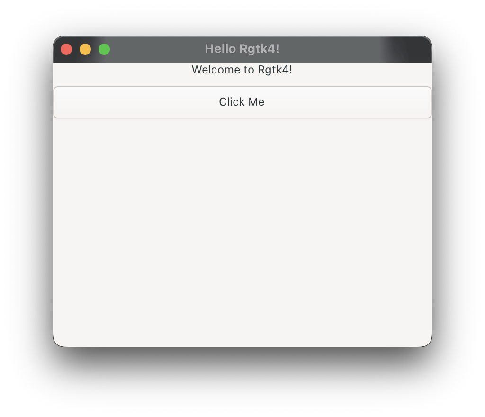

<!-- README.md is generated from README.Rmd. Please edit that file -->

```{r, include = FALSE}
knitr::opts_chunk$set(
  collapse = TRUE,
  comment = "#>",
  fig.path = "man/figures/README-",
  out.width = "100%"
)
```

# Rgtk4

Modern GTK4 bindings for R with comprehensive platform integration.

## Overview

Rgtk4 provides complete, automatically-generated R bindings for GTK4, GLib, GObject, Gio, Pango, and GdkPixbuf. (The same pattern could be used for Cairo). Unlike traditional hand-written bindings, Rgtk4 uses GObject Introspection (GIR) to generate bindings directly from GTK's metadata, ensuring complete API coverage and easy updates.

## Acknowledgments

**This project builds on the pioneering work of the RGtk2 team**, particularly **Michael Lawrence**, whose original RGtk2 package demonstrated the viability of GTK bindings for R. Without RGtk2, Rgtk4 would not exist.

## Features

- **Complete API Coverage**: Auto-generated from GIR files
- **Meaningful Parameter Names**: Parameters use descriptive names from GIR metadata
- **Event Loop Integration**: Native R event loop integration for responsive UIs
- **macOS Integration**: Automatic dock icon management and native shortcuts
- **Clean Architecture**: Separate generator and package for maintainability

## Installation

### Prerequisites

#### Debian/Ubuntu
```bash
sudo apt-get update
sudo apt-get install libgtk-4-dev gobject-introspection \
  libgirepository1.0-dev pkg-config r-base-dev
```

#### Arch Linux
```bash
sudo pacman -S gtk4 gobject-introspection pkgconf r
```

#### Windows
Needs [MSYS2](https://www.msys2.org/) and [`later`](https://cran.r-project.org/web/packages/later)
````bash
pacman -S mingw-w64-ucrt-x86_64-gtk \
          mingw-w64-ucrt-x86_64-gobject-introspection \
          mingw-w64-ucrt-x86_64-pkg-config
````
Afterwards add the following to the PATH = `C:\msys64\ucrt64\bin` (or wherever `libgtk`  is located).

### Building Rgtk4

This is only required for package maintenance, users should not have to regenerate the bindings. This builds the auto generated C and R files.

1. **Generate Bindings** (RGirGen package)

This creates all auto-generated bindings in the Rgtk4 package.

2. **Build and Install Rgtk4**:
```r
# install.packages("remotes")
remotes::install_github("JanMarvin/Rgtk4")
```

## Quick Start

```{r}
library(Rgtk4)

# Initialize GTK and start event loop
gtkInit()
gtkStartEventLoop()

# Create a window
window <- gtkWindowNew()
gtkWindowSetTitle(window, "Hello Rgtk4!")
gtkWindowSetDefaultSize(window, 400L, 300L)

# Add some content
box <- gtkBoxNew(1L, 10L)  # 1 = vertical orientation
gtkWindowSetChild(window, box)

label <- gtkLabelNew("Welcome to Rgtk4!")
gtkBoxAppend(box, label)

button <- gtkButtonNew()
gtkButtonSetLabel(button, "Click Me")
gtkBoxAppend(box, button)

# Connect signals
gSignalConnectR(button, "clicked", function(w) {
  print("Button clicked!")
})

# Show the window
gtkWindowPresent(window)
```


```{r echo = FALSE, warning = FALSE, fig.cap="The Rgtk4 window from above on Mac."}

```

## Architecture

Rgtk4 uses a two-package architecture:

### RGirGen (Generator)
- Parses GIR XML files from GObject Introspection
- Generates C wrappers with proper type conversions
- Generates R functions with meaningful parameter names
- Filters platform-specific functions

### Rgtk4 (Package)
- Contains all auto-generated bindings
- Provides custom helpers (event loop, macOS integration, signal handling)
- Includes utility functions

## Documentation

- GTK4 Documentation: https://docs.gtk.org/gtk4/
- GObject Introspection: https://gi.readthedocs.io/

Note on string-returning callbacks. Callbacks that return strings (e.g. GtkScaleFormatValueFunc) allocate a fresh copy via g_strdup on every invocation. GTK frees this in most cases, but if the API documentation says the return is borrowed/static, the string will leak. Avoid these callbacks in tight loops if memory growth matters.

## Contributing

Contributions welcome! The clean architecture makes it easy to add new helper functions or improve the generator.

## License

GPL-2 | GPL-3 (following R and GTK licensing)

## Distribution

Rgtk4 is not on CRAN or r-universe. Building Rgtk4 does not bundle GTK4 — the resulting binaries link dynamically against a system installation of GTK4 and will not work without one. On Windows this is a particular challenge: GTK4 is only available through environments like MSYS2, and it is unclear whether any current CRAN package takes that route. There are also minor compliance points such as compiler warning suppressions that would need addressing before a CRAN submission, though none of these are fundamental blockers. Getting a package onto CRAN requires sustained engagement with the submission and review process, and without sufficient external pressure or demand that investment is unlikely to happen.

## System Requirements

- R >= 4.0.0
- GTK4 >= 4.0.0
- GObject Introspection >= 1.0.0

## Troubleshooting

### "GTK not found" errors
Ensure `pkg-config --modversion gtk4` returns a version number. If not, GTK4 is not properly installed or not in your PATH.

## Credits

- **RGtk2 Team** - Original GTK bindings for R
- **Michael Lawrence** - RGtk2 lead developer
- **GTK Team** - GTK toolkit and GObject Introspection
- **R Core Team** - R language and development tools
